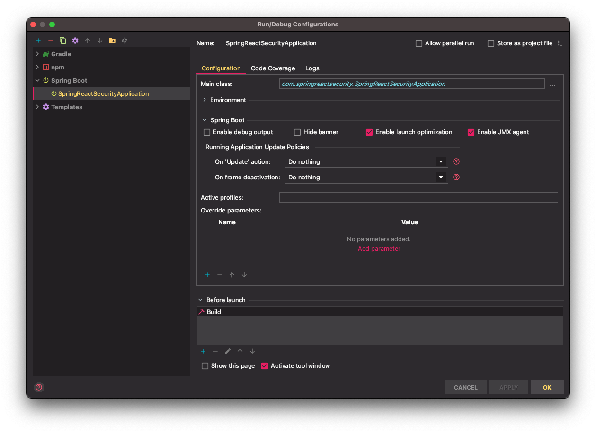
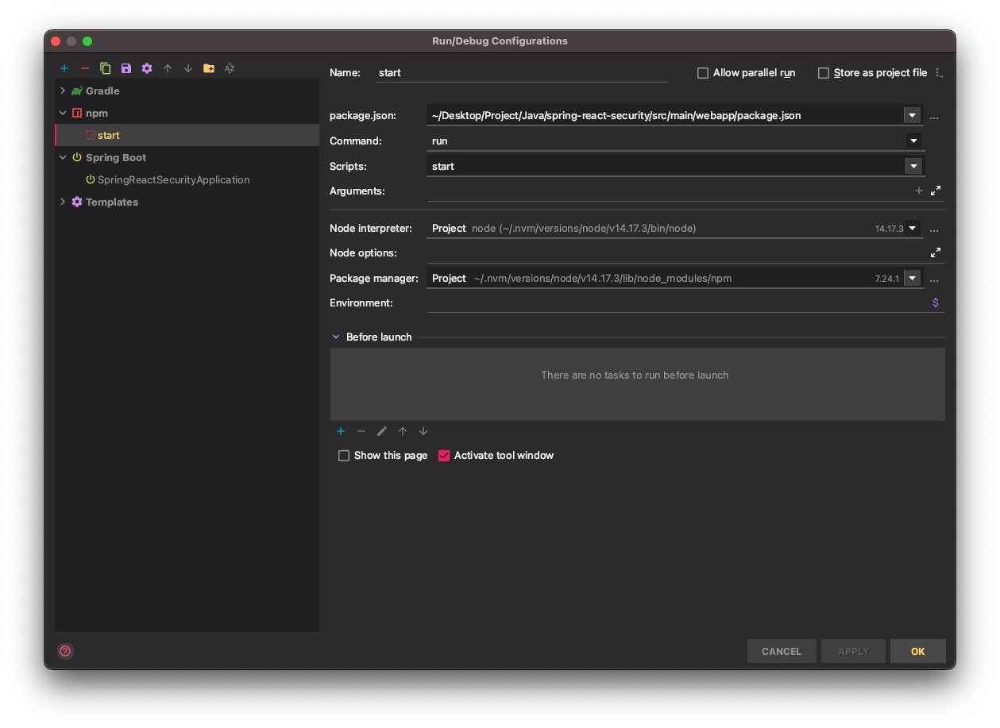
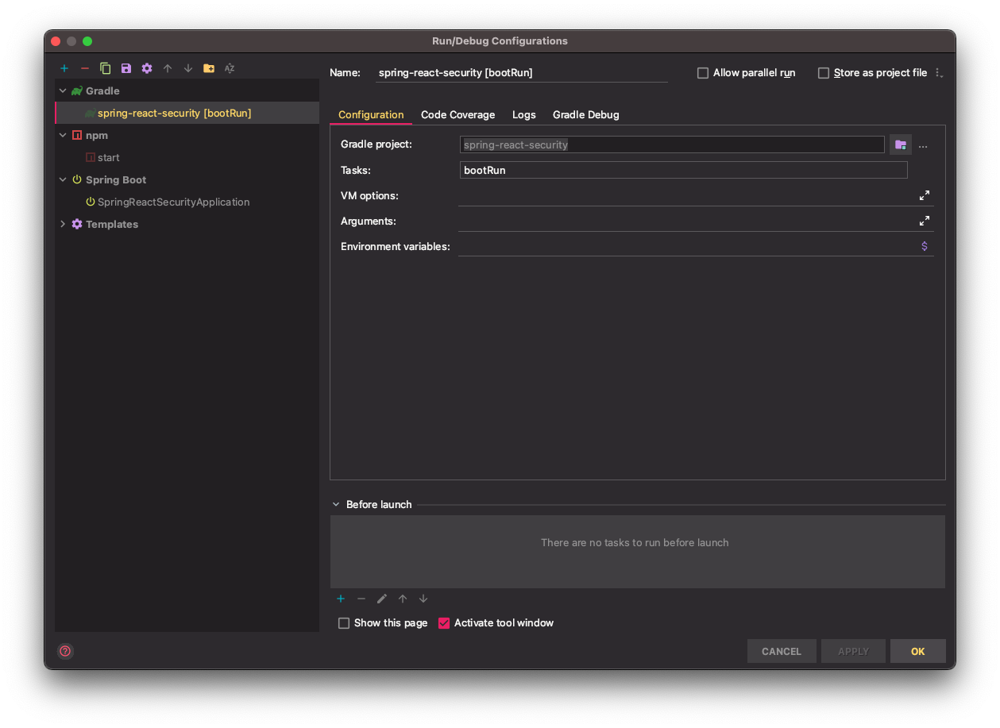

# spring-react-security

본 프로젝트는 Spring Security, React 를 사용하여 기본적인 회원 관리 예제 프로젝트 입니다.<br />
프로젝트 구현시 빠르게 기본기능을 가져다 쓸 수 있습니다.

### Start

설치 및 개발서버 실행

```sh
# 1. 설치
$ npm install

# 2. Java 실행
$ ./gradlew clean bootRun

# 3. 개발서버 실행
$ npm start
```

### Local 개발

- Backend 실행
  


- Frontend 실행
  


- 통합 실행 (배포 환경)
  
  
### API

- `SecurityConfig` 참조
  - 로그인
  - 로그아웃
  

- `Swagger` 참조
  - 회원가입
  - 아이디, 비밀번호 찾기
  - 회원 정보 수정
  - 관리자 모드
  
### Swagger

```shell
http://localhost:28080/swagger-ui/
```

### Docker image build
프로젝트에서 [Docker](https://www.docker.com/) 와 같은 가상화 Container 를 통한 배포를 요구할 경우 본 프로젝트는 Docker image로 빌드할 수 있는 구성을 포함하고 있다.
docker build를 하기 위해서 호스트 pc에 docker가 설치되어 있어야 한다.

- Build image
  ```shell
  docker build --build-arg JAR_FILE=build/libs/spring-react-security-0.0.1-SNAPSHOT.jar -t com.springreactsecurity/springreactsecurity:1.0.0 . 
  ```
- Run image
  ```shell
  docker run --name cwt -d -p 28080:8080 -e JAVA_OPTS="-Dspring.profiles.active=local -Dserver.port=8080" com.springreactsecurity/springreactsecurity:1.0.0
  ```
- log 확인
  ```shell
  docker container logs cwt
  ```
- Stop image
   ```shell
   docker container stop cwt
   ```
- Start image

  container 한 번 생성후에는 아래와 같이 container start 명령어로 재기동 할 수 있다.
  ```shell
  docker start cwt
  ```
- Build image(with gradle)

  gradle 플러그인을 이용해서 docker 를 build 할수 있다.
  ```shell
  gradlew docker 
  ```
더 자세한 내용과 docker 관련 기능은 아래 문서나 기타 인터넷 사이트를 참고 바란다.
- [Docker offical doc](https://docs.docker.com/)
- [spring-boot-docker](https://spring.io/guides/topicals/spring-boot-docker)


### Jib (with docker)
Jib Google 에서 만든 docker 이미지 빌드를 위한 오픈 소스이다. 흥미로운 점은 docker 설치 없이 docker 이미지 빌드를 할 수잇는 점이다.


### UPCOMING

아래와 같은 기능에 관해서 개발자들의 기여를 기대한다.

- [x] SMTP (send Email)
- [ ] 휴대폰 인증
- [ ] Oauth2 인증 (Google, Naver 등)
- [ ] HTTPS
- [ ] Redis
- [ ] 모니터링툴
- [x] Docker
- [ ] 국제화 (영어)
